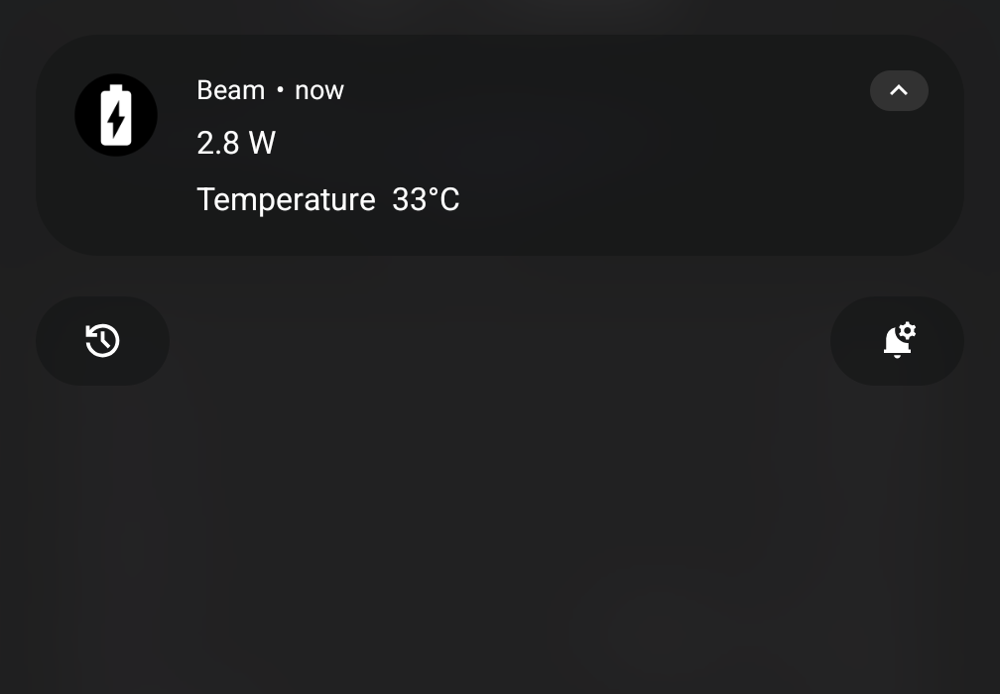
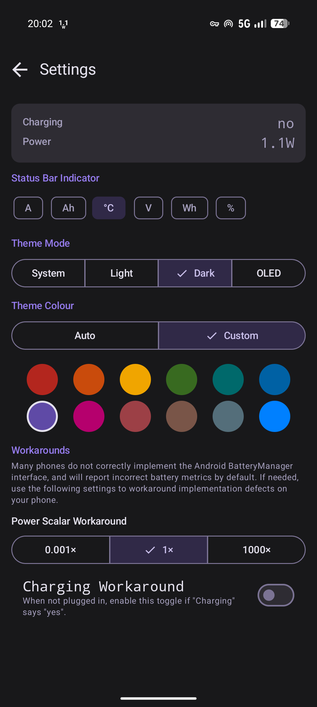

# Beam

*Real-time battery monitor for Android.*

Beam displays live battery metrics as a persistent status bar notification and shows a full breakdown in-app. You can choose which additional metrics appear in the notification body.

## Metrics

- Power (watts)
- Current (amps)
- Voltage (volts)
- Energy level (watt-hours and amp-hours)
- Temperature (celsius)
- Charge level (percent)
- Is charging (yes/no)
- Charging since (date/time)
- Time to full charge (duration)

## Privacy

- No unnecessary permissions
- No ads
- No collection of user data of any kind
- No sharing data with third parties

## Screenshots

  

## FAQ

**Why does my phone always show `0W`?**

Many phones, especially Samsungs, don't follow the BatteryManager spec. Try changing "Power Scalar Workaround" in the settings view.

**Why does my external power meter show different numbers than Beam?**

Beam can only measure power flowing into or out of the battery management system. An external meter also captures power the phone draws on top of that.

**Why isn't the indicator showing up in my status bar?**

Beam needs notification permissions on newer Android phones. Open the app once and grant permissions when prompted, or enable them manually in Android app settings. Note that Android can silently revoke these permissions, so you may need to re-enable them periodically.
